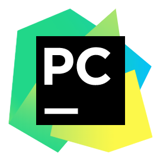

# Tutoring Python Programming, 2021

Python For BigData @ <a href='https://www.facebook.com/jskim.kr'>FB / jskim.kr</a>, [김진수](bigpycraft@gmail.com)

 

## Hana Finance Group

## Notice 
- [교육자료] : https://github.com/bigpycraft/tutoring-python
- [공유폴더] : \192.15.206.251\100000100$
- [보안PW] : itcampus21! 또는 itcampus21!!

## Table of Contents
- Python Programming Basics
- Python Packages and Modules
- Data Processing and Analysis

## Python Develop Environment

<h3> Python </h3>

<table align="left">
    <tr align="left">
        <td width="200">
            
        </td>
        <td width="800">

<b> Latest: Python 3.9.0</b>
  
- Download : https://www.python.org/downloads/windows/
 
- Download the latest version 
 
- Check the OS version & bit (32bit / 64bit)

</td>
    </tr>
</table>
 

<h3> PyCharm </h3>

<table align="left">
    <tr align="left">
        <td width="200">
            
        </td>
        <td width="800">

<b> Latest : Python 3.9 version | Release Date: Oct. 5, 2020</b>
  
- Download : https://www.jetbrains.com/pycharm/download/
 
- Version: 2020.3
 
- Build: 203.5981.165
 
- 2 December 2020
 
- Download Community Version 

</td>
    </tr>
</table>
 

<marquee>The BigpyCraft find the information to design valuable society with Technology & Craft.</marquee>

 &lt; The End &gt; 

